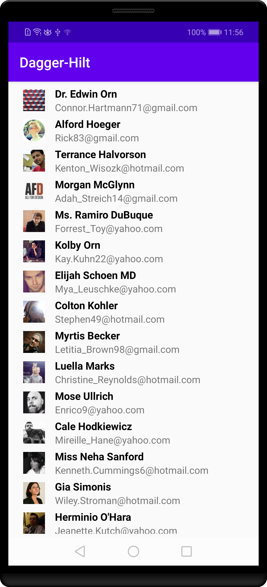

# Dagger-Hilt-Android

## Project Overview
Hilt is the latest attempt from Google to attempt to prevent you from cutting yourself when using Dagger.
 
## Why this project 

## What I learned
- Fetch data from the Internet using Retrofit 2.0
- Use  MVVM, Repository android architecture pattern.
- Use adapters and custom list layouts to populate list views
- Incorporate libraries to simplify the amount of code you need to write

## Use case
 

## Screenshots

